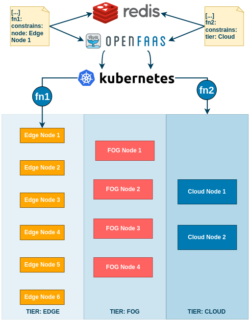

# OpenWolf: A Serverless Workflow Engine for Native Cloud-Edge Continuum

OpenWolf isa general-purpose Serverless Workflow Management System. 
The goal of this project is build a system 
able to exploit the Faas paradigm for composing complex scientific 
workflows connecting  one or more functions distributed among 
the Cloud-Edge Continuum.



## Manifest
A Workflow definition is done using a well structured YAML Workflow Manifest,
```yaml
name: <workflow-name>
    callbackUrl: <uri-where-to-send-result>
    states:
      <state-id>:
        function:
          ref: <ref-to-function-id>
          config:
            key: value
          constrains:
             key: value 
        start: true
    functions:
      <function-id>:
        platform: openfaas
        endpoint: <endpoint-to-function>
        config:
          key: value
    workflow:
      <state-id>:
        activation: <Boolean Equation>
        inputFilter: <jq command>
        outputFilter: <jq command>

```
The function part contains all the function definitions that are consumed 
in the workflow. 
In each definition, we need to indicate at which URL 
it can be triggered and the default configuration parameters. 

The States part contains the set of the workflow's building blocks. 
They are used to envelop a function and they can be triggered only 
once for each execution. For each state, 
we need to specify which function is triggered when 
the state is active and the configuration of custom parameters 
that overrides the default ones previously declared as a function parameter.

The Workflow part defines, instead, the rules that link together the states.
For each state that composes the workflow, we need to give the action function, 
which is a boolean combination of the other states, 
and when it is verified it tells the \ wfname agent to trigger the State.
Moreover, each state output, could be not compatible with the 
input of the next State in the workflow, for this reason, we need to filter them.
We do that using the inputFilter and outputFilter properties, 
enhanced with JQ instructions. JQ is a command-line utility that is thought to extract information like grep or awk, but it is specialized on JSON documents.


## Event
The output returned by the state/function when this terminates 
its execution is defined within the event data structure. 
This is expressed using a JSON format, in which 
the main properties are called ctx and data.
The ctx represents the event context and it is 
composed of the workflowID, which references the workflow 
to which event it belongs, the execID, which distinguishes 
the different executions of the same workflow, and the state, 
which references the state that has returned the event.

The data property, instead, is the function's output itself and, 
unlike the ctx that is read and set by the workflow agent, 
this is fully managed by the function.

```json
{
    "ctx": {
        "workflowID": "inference-traffic",
        "execID": inference-traffic.123,
        "state": "C"
    },
    "data": {
        "AIQ": 47,
        "Scale": "EU"
    }
}

```

## Architecture
From the architectural point of view, we have to federate the Continuum layers, 
that is creating a single computing cluster that collects every node in the 
Continuum and manages them with the same interface. This process allows to 
orchestrate and compose the functions, as well as spread them in the Continuum. 
For federating the Continuum we chose to use K3S, a Kubernetes distribution mainly 
thought to be executed in unattended, resource-constrained, remote locations or 
inside IoT appliances, even maintaining all the Kubernetes features.
K3S is mainly used in Edge environments, in fact, it can be run in ARM64 and 
ARMv7 architectures, but it supports also x64 platforms. Indeed, this requires very accessible system characteristics with only 1 GB of RAM and 1 CPU installed. K3S can then be easily used to federate a Continuum environment by installing an agent in each node of the Continuum.

Over K3S nodes we have to install a Serverless Engine to build, deploy 
and trigger functions. The OpenFaaS engine is the best choice because 
this is a Kubernetes-based open-source FaaS provider. It allows defining 
functions in several programming languages such as Java, Python, and Javascript
 and deploying them inside a Kubernetes pod. More specifically, OpenFaaS is 
 the right choice because of the capabilities to (i) build functions for 
 multiple architectures at one time, using Docker's Codex, (ii) integrate 
 with Kubernetes, (iii) natively use Kubernetes features such as node selectors, 
 affinity, and anti-affinity for conditioning the function schedule, and (iv) 
 support synchronous and asynchronous function invocations.
According to these features, we can develop a single function and make it 
automatically suitable and for deployment at any Continuum tier.

The cluster architecture is then completed with a Redis instance that is 
used to store the workflow manifests and the workflow execution's information.

## Agent

To achieve the composition, OpenWolf has to ensure that any event will follow the correct path in the workflow it 
belongs to and then trigger the correct states in the workflow with a 
proper transformation of the right income event. 
In this regard, the OpenWolf agent is deployed as a 
standalone stateless microservice, deployed with inside the same 
Kubernetes Cluster we used to run the serverless functions.

The Agent exposes two interfaces. The first one is a public interface used to trigger a workflow from the external. The second one is closed inside the Kubernetes cluster and it is used as a callback URL for each asynchronous function triggered by any workflow.
By doing that, the agent intercepts all the events belonging to a workflow, 
extracts the context information, 
and uses it for fetching all the workflow and current execution information. 
Therefore, it triggers the next states in the manifest, forwarding the right 
received event with the updated ctx property.